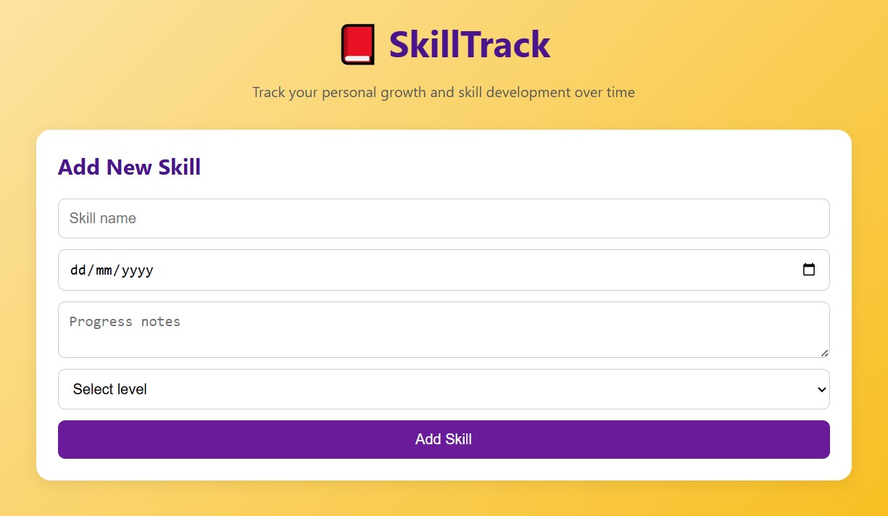

# 📕 SkillTrack 📒

**SkillTrack** is a self-development tracker app designed to help users log, monitor, and reflect on the progress of their personal skills. Built with **Motoko** for the backend and **React + Vite** for the frontend, the app runs on the **Internet Computer blockchain**.

---

## ✨ Features

- ✅ Add new skills
- 📝 Log start date and progress notes
- 📊 Choose skill level (Beginner, Intermediate, Advanced)
- 🔄 Edit or update skills
- ❌ Delete any skill
- ⏳ See the full timeline of your skill-building journey

---

## 🛠️ Tech Stack

- 💻 **Motoko** (IC backend with stable variable support)
- ⚛️ **React 18** + **Vite** for the frontend
- 📡 Deployed on **Internet Computer (ICP)**
- 🎨 Clean and modern UI with responsive design

---

## 🚀 Getting Started

### 1. Clone the repository

```
git clone https://github.com/silviuovidiu57/SkillTrack.git
cd skilltrack
```

### 2. Launch locally on the IC dev environment

```
dfx start --background
dfx deploy
```

### 3. Run the frontend

```
cd frontend
npm install
npm run dev
```
Visit the app at: http://localhost:5173

---

## 📁 Project Structure

```
skilltrack/
├── backend/
│   └── app.mo              # Motoko backend logic
├── frontend/
│   ├── index.html
│   ├── main.jsx
│   ├── app.jsx             # React component
│   ├── style.css           # Custom UI styling
│   └── style.css 
├── dfx.json
├── mops.toml
├── README.md
└── BUILD.md
```

---

## 📸 Screenshots
Coming soon

<div align="center">
  
</div>

---

## 🤝 Contributing
Contributions are welcome! Feel free to open issues, submit pull requests, or suggest improvements to enhance this project.

---

## 📄 License
MIT License © 2025 Silvi Ovidi

---

## 🌐 Built on Internet Computer
SkillTrack is part of a microproject series designed to explore dApp development using Motoko and ICP technology.